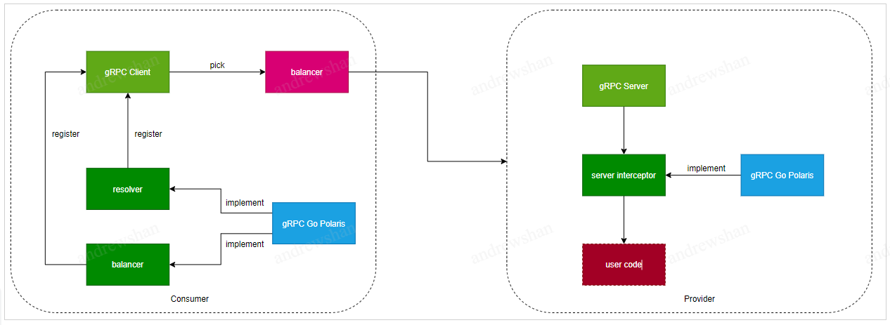

# gRPC-Go-Polaris

[English](./README.md) | 简体中文 

---

## 介绍

gRPC-Go-Polaris 提供了基于 gRPC-Go 扩展的一系列服务治理组件，基于 gRPC-Go 的开发者可以使用这些组件快速进行分布式应用的开发。

## 主要功能

* **服务注册与心跳**：基于 gRPC Service 的标准进行微服务的注册以及定时上报心跳。
* **动态路由与负载均衡**：基于 gRPC resolver 与 balancer 的接口标准，提供场景更丰富的动态路由以及负载均衡的能力。
* **故障节点熔断**：提供统计接口调用健康度的能力，基于调用健康度数据，对故障节点在负载均衡时进行剔除。
* **服务限流**：基于 gRPC interceptor 的接口标准，提供被调端限流功能，保证后台微服务稳定性，可通过控制台动态配置规则，及查看流量监控数据。

## 基本架构


gRPC-Go-Polaris 主要是在 gRPC-Go 基础上进行接口的扩展，以支持服务治理相关的能力。

## 如何使用

### 前置条件

- Go：使用最新的3个主版本 [releases](https://go.dev/doc/devel/release)。

### 安装方式

基于[Go module](https://github.com/golang/go/wiki/Modules)能力的支持（Go 1.11+），用户只需要在代码中加入以下依赖：
```
import "github.com/polarismesh/grpc-go-polaris"
```
然后执行 `go [build|run|test]` 后会自动拉取必要的依赖项。

或者，如果需要独立安装 `grpc-go-polaris` 包，可以执行以下命令：

```
$ go get -u github.com/polarismesh/grpc-go-polaris
```

注意：gRPC-Go-Polaris 依赖了 `gRPC-Go`，在中国拉取 `gRPC-Go` 可能会出现超时问题，具体解决方案可以参考：[FAQ](https://github.com/grpc/grpc-go#FAQ)。

### 使用样例

- [快速入门](examples/quickstart/README-zh.md)
