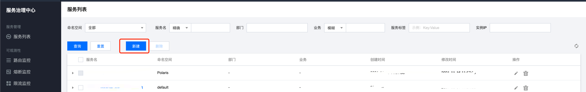

# grpc go polaris 快速入门项目

提供 grpc client 端 server 端应用示例，演示 grpc 应用如何快速接入北极星。

[English](./README.md) | 简体中文

## 目录介绍

- rpcServer: server 端示例，提供 grpc 服务。同时启动后连接北极星，进行服务注册，并发送心跳保持健康状态，应用退出时会进行反注册。
- rpcClient: client 端示例，调用 server 中的 grpc 服务。通过北极星服务发现拿到 server 的地址。
- model: 示例中使用的 pb 定义。

## 如何构建

依赖 go mod 进行构建。

构建 server：
```shell
cd rpcServer
go build -o server
```

构建 client：

```shell
cd rpcClient
go build -o client
```


## 如何使用

### 创建服务

预先通过北极星控制台创建对应的服务，如果是通过本地一键安装包的方式安装，直接在浏览器通过 `127.0.0.1:8090` 打开控制台。



### 修改配置

修改配置，填写北极星 server 的地址。

```yaml
global:
  serverConnector:
    addresses:
    - 127.0.0.1:8091
```

### 执行程序

运行 server：
```shell
./server default DemoService 127.0.0.1 9090 2
```
启动参数解释：
- server 注册的服务所在命名空间。
- server 注册的服务名。
- server 注册的服务实例 ip。
- server 注册的服务实例 port。
- server 上报心跳的间隔。

运行 client：

```shell
./client default DemoService 5 1
```
启动参数解释：
- client 调用服务所在命名空间。
- client 调用服务名。
- 发送的请求数。
- client 从北极星同步服务实例的间隔。